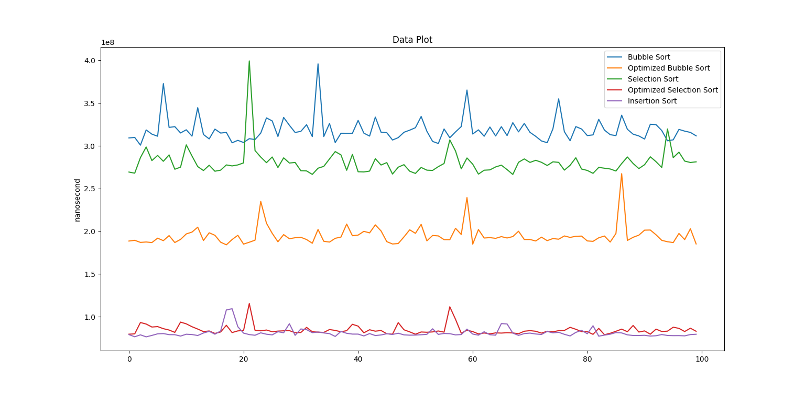

# Sorting Algorithms

This repository contains implementations of sorting algorithms along with their optimized versions and .txt files containing the execution time of the sorting algorithms for random lists with 10.000 elements.

# Motivation for the randomLists.txt file

This file has 100 lists with random integers (from 0 to 10000) so that the tests for each sorting algorithm can be done with the same lists, and that's also true for future algorithms that shall be implemented.

# Results found so far

## Made by:

* [Gabriel Pavanato](https://github.com/Pavanato)
* [Roberta Muller Nunes](https://github.com/robertamuller)
