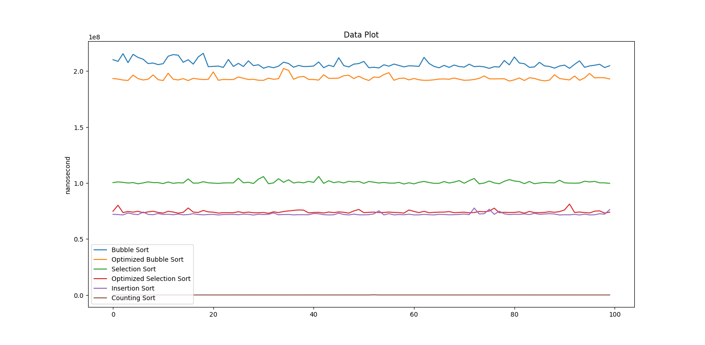
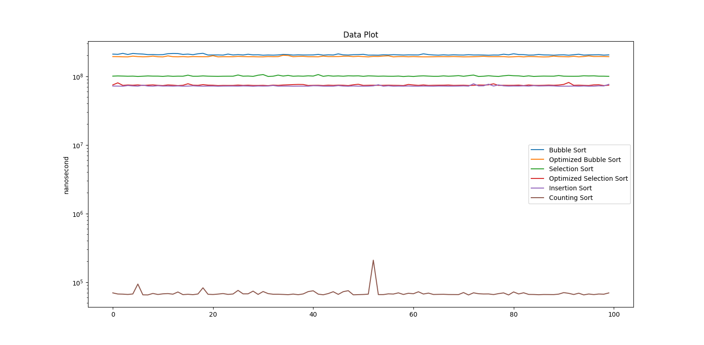

<h1>Sorting Algorithms</h1>

This repository contains implementations of sorting algorithms along with their optimized versions and .txt files containing the execution time of the sorting algorithms for random lists with 10,000 elements.

<h2>Motivation for the randomLists.txt file</h2>

This file contains 100 lists with random integers (from 0 to 10,000) so that the tests for each sorting algorithm can be done with the same lists, ensuring consistency for future algorithms that will be implemented.

<h2>Results found so far</h2>

In logarithmic scale:

<h2>Counting Sort</h2>

Counting Sort is an efficient, non-comparative sorting algorithm suitable for ordering a collection of data where the elements belong to a known and limited range of values. The algorithm counts the occurrence of each value and uses these counts to determine the exact position of each element in the sorted list.

<h3>How Counting Sort Works</h3>
<ul>
    <li><strong>Identify the minimum and maximum values:</strong> First, the minimum and maximum values in the list are found to determine the range of values.</li>
    <li><strong>Initialize the counting array:</strong> A counting array is created with a size adequate to store the count of each distinct value.</li>
    <li><strong>Count the occurrences:</strong> The frequency of each value in the original list is counted and these counts are stored in the counting array.</li>
    <li><strong>Update the original list:</strong> The linked list is updated with the sorted elements using the counting array.</li>
</ul>

<h3>Example</h3>

Suppose we have a linked list of numbers <code>[4, 2, 2, 8, 3, 3, 1]</code> and we want to sort it using Counting Sort.

<h4>Step 1: Identify the Minimum and Maximum Values</h4>

First, identify the minimum and maximum values in the list:

<pre><code>Minimum value: 1
Maximum value: 8</code></pre>

<h4>Step 2: Initialize the Counting Array</h4>

Create a counting array with size <code>8</code> (from 1 to 8), initialized with zeros:

<pre><code>Count = [0, 0, 0, 0, 0, 0, 0, 0]</code></pre>

<h4>Step 3: Count the Occurrences</h4>

Count the frequency of each value in the original list:

<pre><code>Original list: [4, 2, 2, 8, 3, 3, 1]
Count: [1, 2, 2, 1, 0, 0, 0, 1]</code></pre>

<h4>Step 4: Update the Original List</h4>

Use the counting array to update the elements in the linked list:

<pre><code>Sorted list: [1, 2, 2, 3, 3, 4, 8]</code></pre>

<h2>Authors</h2>
<ul>
    <li><a href="https://github.com/Pavanato">Gabriel Pavanato</a></li>
    <li><a href="https://github.com/robertamuller">Roberta Muller Nunes</a></li>
</ul>

</body>
</html>
